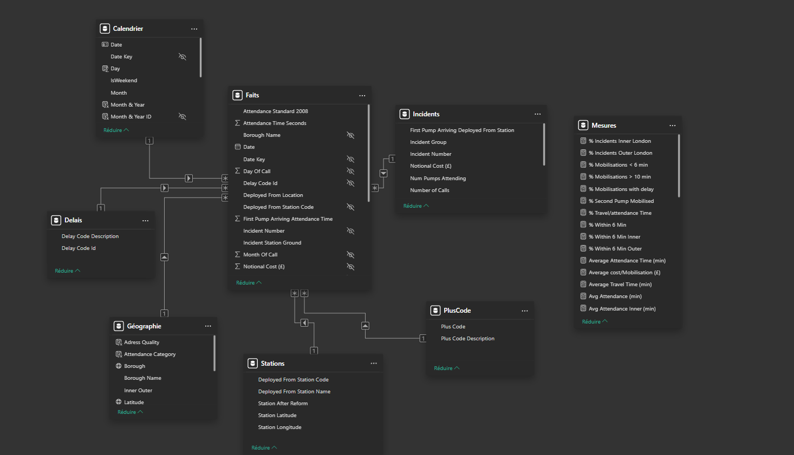
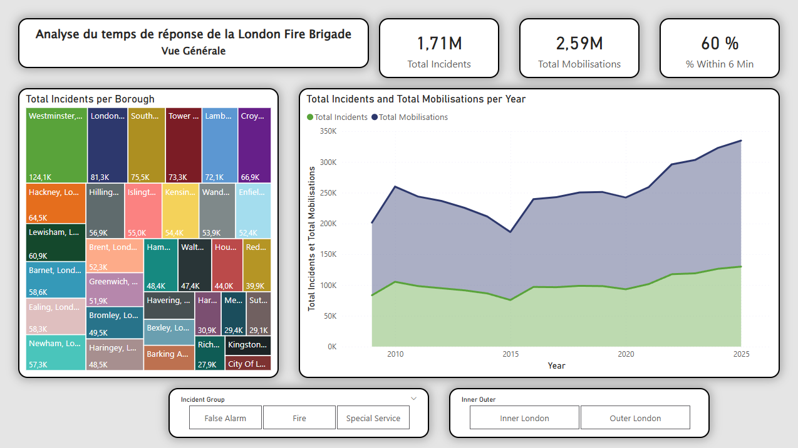
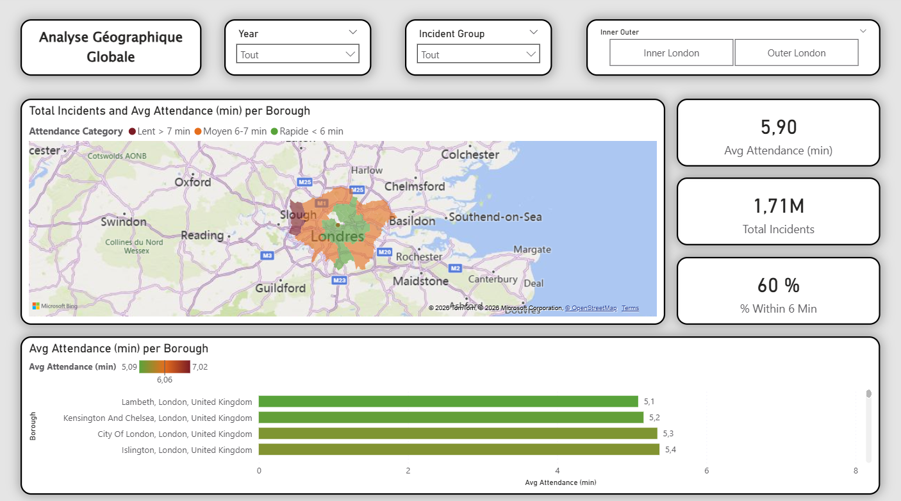
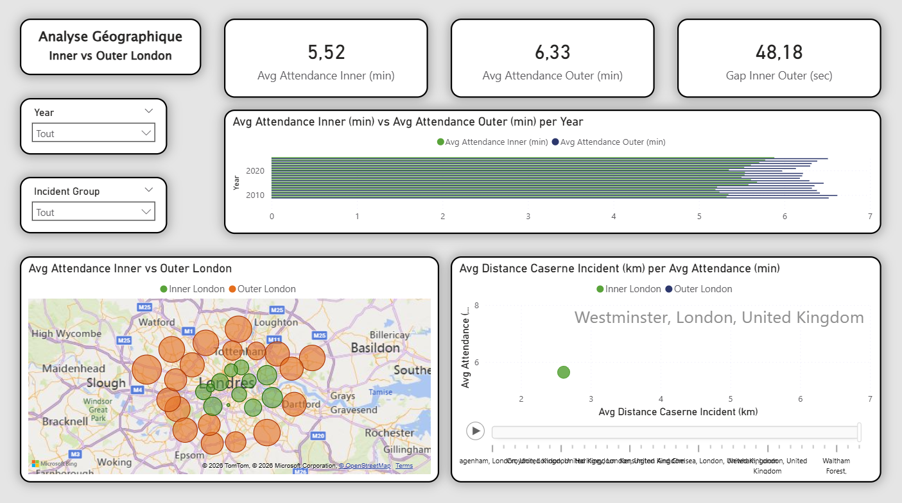
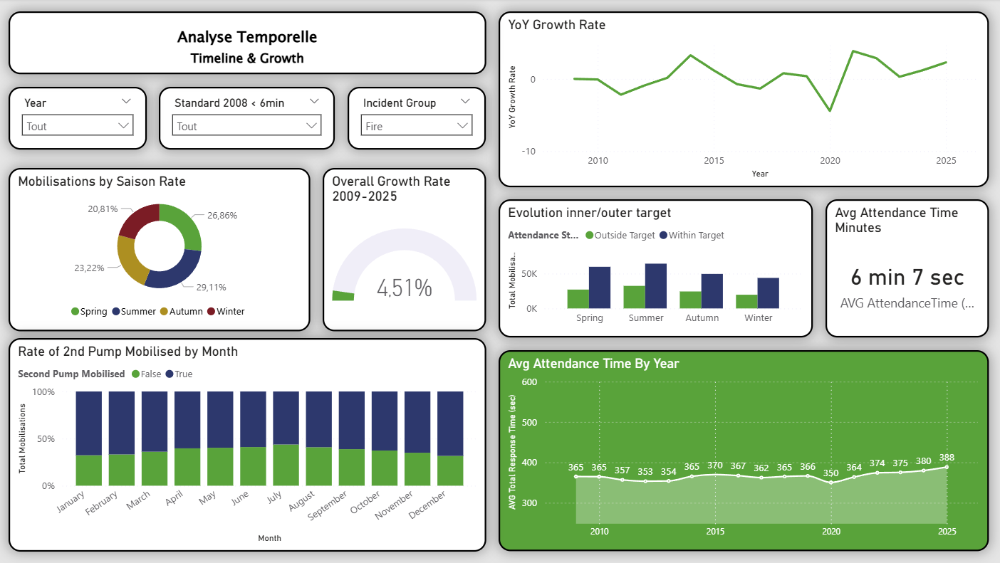
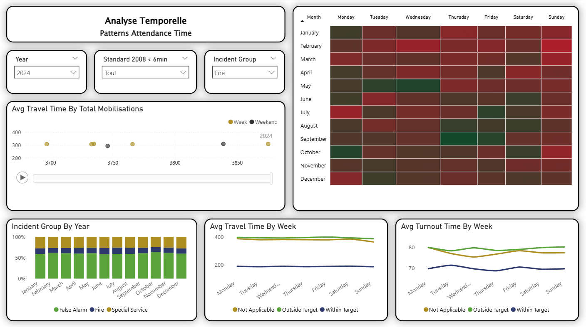
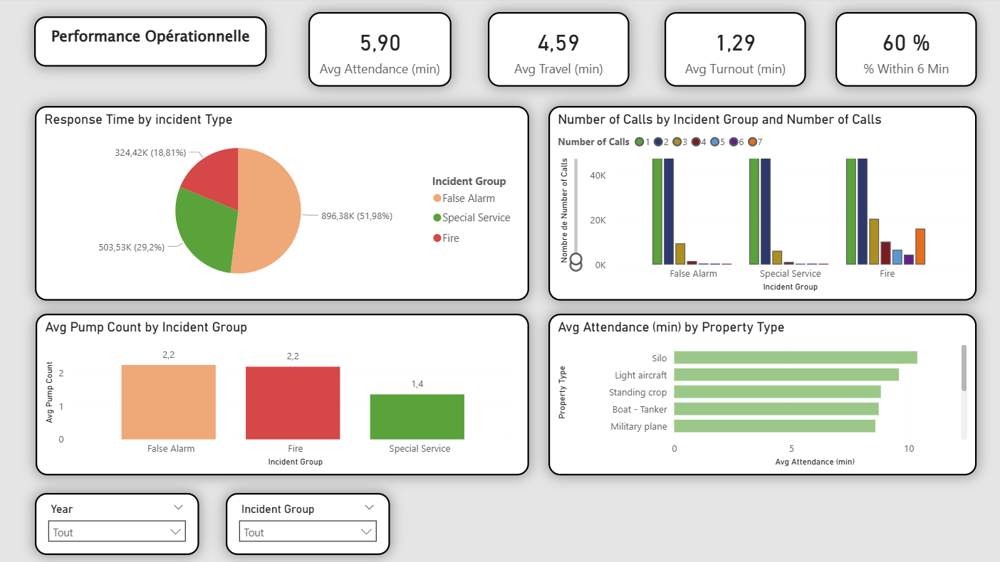
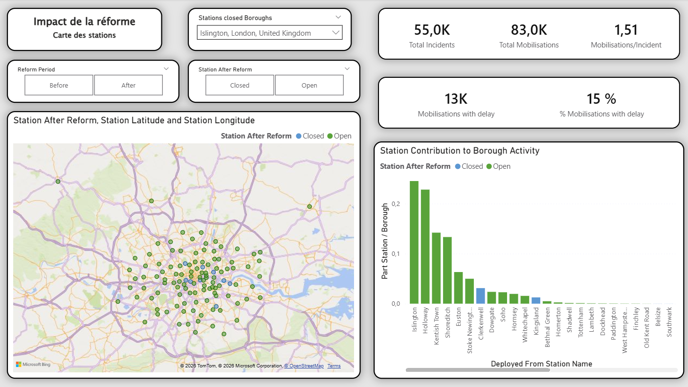
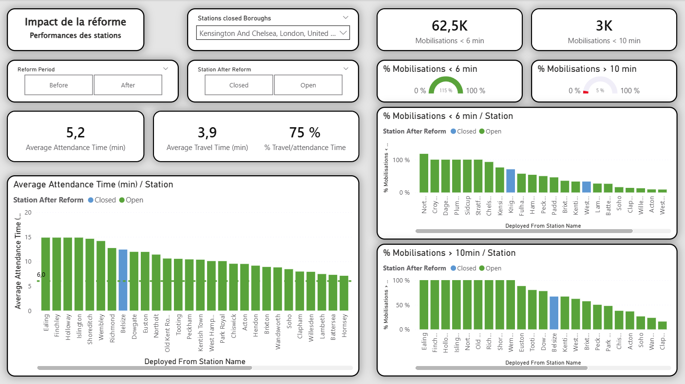
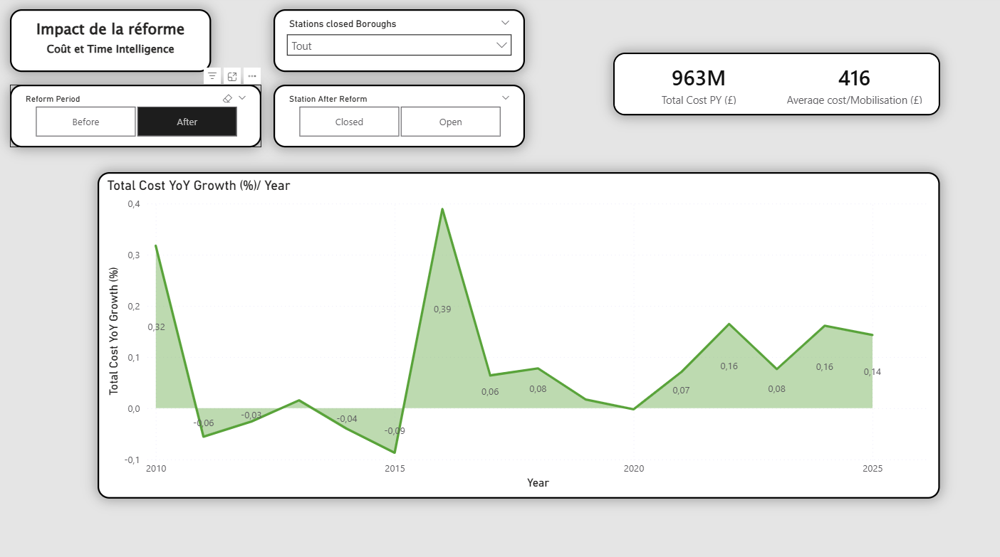

# 🚒 London Fire Brigade — Response Time Analysis

> Analyse des temps de réponse de la Brigade des Pompiers de Londres | Python · Power BI  
> Projet fil rouge — Formation Data Analyst (Liora, co-certifiée École des Mines)

---

## 📌 Contexte & problématique

La **London Fire Brigade (LFB)** est le service d'incendie et de sauvetage le plus actif du Royaume-Uni et l'une des plus grandes organisations de lutte contre l'incendie au monde. Elle fixe un seuil de temps d'intervention de **6 minutes** pour l'arrivée du premier camion et de **8 minutes** pour le second.

Ce projet a été réalisé en groupe de 4 dans le cadre de la formation Data Analyst Liora. Chaque membre portait une problématique analytique distincte :

| Membre | Problématique |
|---|---|
| **Arnaud (moi)** | **Impact géographique sur les temps de réponse** |
| Nicolas | Dimension temporelle et saisonnière |
| Rayan | Performance opérationnelle par type d'incident |
| Noura | Impact de la restructuration de 2014 |

**Ma problématique** : les caractéristiques géographiques (Inner vs Outer London, distance caserne-incident) ont-elles un impact significatif sur les temps de réponse ?

---

## 🗂️ Structure du projet

```
london-fire-brigade-analysis/
├── README.md
├── notebook/
│   └── Code_propre_etape5.ipynb         ← notebook Python (preprocessing collectif)
└── screenshots/
    ├── 01_modele_etoile.png
    ├── 02_vue_generale.png
    ├── 03_geo_globale.png
    ├── 04_inner_vs_outer.png
    ├── 05_timeline_growth.png
    ├── 06_patterns_attendance.png
    ├── 07_performance_operationnelle.png
    ├── 08_reforme_carte.png
    ├── 09_reforme_performance.png
    └── 10_reforme_cout.png
```

---

## ⚙️ Phase 1 — Preprocessing Python (Google Colab)

**Source** : [London Fire Brigade Open Data](https://data.london.gov.uk/dataset/london-fire-brigade-incident-records) — fichiers Incidents + Mobilisations (2009–2026)

### Ma contribution directe

J'ai pris en charge le **pre-processing des fichiers Incidents 2018-2026** (~954 000 lignes sur 2 fichiers) ainsi que l'**étape 1 d'exploration et de qualité des données** sur le dataset fusionné.

| Étape | Responsable | Contenu |
|---|---|---|
| Pre-processing & chargement | **Arnaud** + Noura | Analyse variable par variable (41 variables), documentation dans un tableau Excel partagé |
| Étape 1 — Exploration & qualité | **Arnaud** | Doublons (5 254 détectés), gestion types, suppression de 14 colonnes, standardisation casse |
| Étape 2 — Visualisations exploratoires | Nicolas | Distributions, top 10, analyse spatiale géolocalisée |
| Étape 3 — Nettoyage | Noura | Traitement NaN par variable, winsorisation à 1% |
| Étape 4 — Comparaisons avant/après | Nicolas | Visualisations de validation |
| Étapes 5-6 — Validation & export | Rayan | Export du fichier `lfb_cleaned_final.csv` |

### Décisions de traitement clés

| Variable | Taux NaN | Décision | Justification |
|---|---|---|---|
| SpecialServiceType | ~65% | Conservée | NaN = incidents Fire et False Alarm (pas une erreur) |
| SecondPumpArriving_AttendanceTime | ~63% | Conservée + flag | Absence de 2nd camion sur la majorité des interventions |
| Doublons (5 254 lignes) | — | Supprimés | Artéfact de la jointure Incidents/Mobilisations |

---

## 📊 Phase 2 — Modélisation & Analyse Power BI

### Modèle en étoile

J'ai construit l'intégralité du modèle en étoile dans Power BI : 1 table de faits, 6 tables de dimensions, 1 table de mesures.



| Table | Type | Clé de jointure | Contenu |
|---|---|---|---|
| Faits | Faits | — | 23 colonnes : temps, ressources, clés |
| Calendrier | Dimension | Date | Créée en DAX (CALENDARAUTO) |
| Géographie | Dimension | Borough Name | Borough, Inner/Outer, coordonnées GPS |
| Incidents | Dimension | Incident Number | Type, catégorie, nombre d'appels |
| Stations | Dimension | Station Code | Nom, coordonnées GPS |
| Délais | Dimension | Delay Code Id | Codes et descriptions des retards |
| PlusCode | Dimension | Plus Code | Type de mobilisation |
| Mesures | Mesures | — | Toutes les mesures DAX centralisées |

### Traitement Power Query notable

La **table Géographie** a été la plus complexe : conversion des coordonnées British National Grid (BNG) en WGS84 via une formule itérative en langage M, ajout de colonnes Pays/Ville/Borough pour forcer la géolocalisation correcte dans Power BI (sans quoi Camden était placé en Australie).

---

## 📈 Mes rapports (problématique géographique)

### Page 1 — Vue Générale

KPIs : **1,71M incidents** · **2,59M mobilisations** · **60% dans les 6 minutes**

Treemap des incidents par borough + évolution temporelle + filtres par type d'incident et zone Inner/Outer.

Westminster arrive en tête avec 124 100 incidents — la densité d'activités de l'hypercentre explique cette concentration.



---

### Page 2 — Analyse Géographique Globale ⭐

Carte choroplèthe colorant chaque borough selon sa catégorie de temps d'intervention (vert < 6 min, orange 6–7 min, rouge > 7 min), classement par temps moyen.

**Lambeth** affiche le meilleur temps : **5,1 min**. **Hillingdon** le plus élevé : **7,02 min** — soit un écart de près de 2 minutes en contexte d'urgence.



---

### Page 3 — Inner vs Outer London ⭐

L'analyse phare de ma problématique. Comparaison des 14 boroughs Inner London vs les boroughs Outer London.

| Métrique | Inner London | Outer London | Écart |
|---|---|---|---|
| Temps moyen d'intervention | **5,52 min** | **6,33 min** | **48,18 sec** |
| % interventions < 6 min | Plus élevé | Plus faible | — |

**Tendance encourageante** : l'écart se réduit progressivement — de **71 secondes en 2009** à **37 secondes en 2025**, ce qui suggère une amélioration relative des performances en Outer London.

Le nuage de points révèle une **corrélation positive entre distance caserne-incident et temps d'intervention** : les stations Outer London sont plus éloignées, ce qui explique en partie le différentiel.



---

## 📈 Rapports des autres membres

### Analyse Temporelle (Nicolas)

Progression globale du délai de réponse : **+4,58%** sur 2009–2026. L'été concentre le plus de mobilisations avec une hausse significative des incendies. Juillet, novembre et décembre sont les mois les plus chargés.





---

### Performance Opérationnelle (Rayan)

Temps moyen d'intervention : **5,90 min** = 4,59 min trajet + 1,29 min mobilisation. Les false alarms représentent **52%** du volume total d'interventions.



---

### Impact de la Restructuration de 2014 (Noura)

Analyse avant/après la fermeture de casernes en 2014. Les casernes fermées étaient toutes en Inner London avec une faible contribution à l'activité du borough. Après la réforme, la charge a été redistribuée et le nombre de casernes intervenantes par borough a augmenté.







---

## 💡 Insights clés (ma problématique)

**1. La géographie impacte significativement les temps de réponse**  
Écart systématique de 48 secondes entre Inner et Outer London sur 16 ans de données, confirmé par la corrélation distance-temps.

**2. L'écart se réduit progressivement**  
De 71 sec (2009) à 37 sec (2025) — signal d'amélioration opérationnelle en périphérie, possiblement lié à la réforme de 2014 ou des améliorations logistiques.

**3. Lambeth vs Hillingdon : 2 minutes d'écart**  
L'écart entre le borough le plus rapide et le plus lent est considérable dans un contexte d'urgence où chaque seconde compte.

**4. Les fausses alarmes représentent plus de la moitié des interventions**  
Ce volume mobilise des ressources qui pourraient être allouées à des incidents réels.

---

## 🧰 Stack technique

| Outil | Usage |
|---|---|
| Python (pandas, numpy, matplotlib, seaborn) | Preprocessing, exploration, nettoyage, export |
| Google Colab | Environnement collaboratif Python |
| Power BI (Power Query, DAX, modèle en étoile) | Modélisation, mesures, rapports interactifs |
| Google Sheets | Tableau de pre-processing partagé |

---

## 📚 Sources

- Dataset : [London Fire Brigade — Incident Records](https://data.london.gov.uk/dataset/london-fire-brigade-incident-records)
- Dataset : [London Fire Brigade — Mobilisation Records](https://data.london.gov.uk/dataset/london-fire-brigade-mobilisation-records)
- Coordonnées GPS des stations : fichier complémentaire téléchargé en ligne

---

## 👥 Crédits

Projet réalisé en groupe dans le cadre de la formation **Data Analyst — Liora (co-certifiée École des Mines)**, promotion février 2026.

Groupe : Rayan Belharat, **Arnaud Houpert**, Noura Romari, Nicolas Sottero
